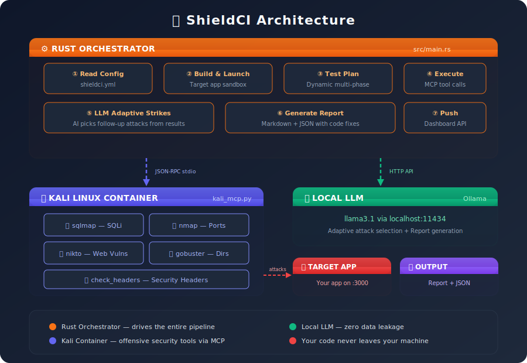

<div align="center">

# 🛡️ ShieldCI

**AI-powered automated penetration testing for your CI pipeline.**

ShieldCI scans your application for real security vulnerabilities using offensive security tools — orchestrated by a local LLM that **never sees your code leave your machine**.

[](https://www.rust-lang.org/)
[](https://www.docker.com/)
[](https://ollama.com/)
[](LICENSE)

</div>

---

## Why Local-First?

ShieldCI runs **entirely on your machine** — the engine, the LLM, and all security tooling. This is a deliberate design choice:

| Principle | What it means |
|-----------|--------------|
| 🔒 **Your code never leaves your network** | No source code is uploaded to any third-party server. The LLM (Ollama) runs locally, scans happen inside a Docker container, and results stay on disk. |
| 🛑 **Zero data leakage risk** | Unlike cloud-based security scanners, there is no API that receives your codebase. This matters for proprietary, enterprise, and pre-release code. |
| ⚙️ **Full control** | You choose the model, the tools, and the scan depth. Nothing phones home. |

> **Future: Hosted option for open-source repos**
>
> We plan to offer an optional hosted version for projects that don't need code confidentiality (e.g. open-source repositories). The local-first mode will always remain the default for private codebases.

---

## Architecture

<p align="center">
  
</p>

**Pipeline flow:**

1. **Read config** — parse `shieldci.yml` for endpoints, build commands, database info
2. **Build & launch** — install deps, start the target app in a sandbox
3. **Generate test plan** — dynamic multi-phase plan based on config + codebase analysis
4. **Execute tools** — fire offensive security tools via MCP (JSON-RPC over stdio) through a Kali container
5. **LLM adaptive strikes** — the LLM reviews scan results and picks follow-up targeted attacks
6. **Generate report** — Markdown report with vulnerable code snippets and exact fix suggestions
7. **Push results** — optionally send structured JSON to the ShieldCI dashboard

---

## Prerequisites

| Requirement | Version | Notes |
|------------|---------|-------|
| **Rust** | 1.77+ | `curl --proto '=https' --tlsv1.2 -sSf https://sh.rustup.rs \| sh` |
| **Docker Desktop** | Latest | Must be running |
| **Ollama** | Latest | `ollama pull llama3.1` |

---

## Quick Start

### Option A — Native (recommended for development)

```bash
# 1. Build the Rust orchestrator
cargo build --release

# 2. Build the Kali MCP Docker image
docker build -t shieldci-kali-image .

# 3. Add a shieldci.yml to your target repo (see Configuration below)

# 4. Run ShieldCI from your target repo directory
/path/to/shield-ci
```

### Option B — All-in-One Container

Run everything in a single container — Rust orchestrator, Kali tools, and Python MCP server. Only Ollama runs on the host.

```bash
# Make sure Ollama is running on the host
ollama serve &

# Launch with Docker Compose (one command)
docker compose up --build
```

Or build and run manually:

```bash
docker build -f Dockerfile.allinone -t shieldci-allinone .

docker run --rm \
  --network host \
  -v /path/to/your/target-repo:/workspace \
  -e OLLAMA_HOST=http://host.docker.internal:11434 \
  shieldci-allinone
```

### Run against the included test app

```bash
cd tests
npm install
cd ..

# Native
cargo run --release

# Or with Docker Compose (mounts ./tests automatically)
docker compose up --build
```

---

## Configuration — `shieldci.yml`

Place a `shieldci.yml` in the root of the repository you want to scan. This tells ShieldCI how to build, run, and attack your app.

### Full Schema

```yaml
# ── Project metadata ──
project:
  name: "my-app"
  framework: "Node.js"
  language: "javascript"

# ── Build & Run ──
build:
  command: "npm install"
  run: "node app.js"
  port: 3000

# ── API Endpoints ──
endpoints:
  - path: "/"
    method: "GET"
    description: "Health check"

  - path: "/login"
    method: "GET"
    params:
      - name: "username"
        type: "string"
        description: "User login name"
    description: "User login endpoint - queries database"

  - path: "/api/search"
    method: "GET"
    params:
      - name: "query"
        type: "string"
        description: "Search term"
    description: "Search endpoint"

  - path: "/api/users"
    method: "POST"
    params:
      - name: "name"
        type: "string"
      - name: "email"
        type: "string"
      - name: "password"
        type: "string"
    description: "User registration"

# ── Database ──
database:
  type: "sqlite"
  orm: false          # false = raw SQL queries → HIGH RISK flag

# ── Authentication ──
auth:
  enabled: false

# ── Key source files ──
files:
  - "app.js"
  - "routes/auth.js"
```

### Schema Reference

| Section | Field | Type | Required | Description |
|---------|-------|------|----------|-------------|
| `project` | `name` | string | no | Project name |
| `project` | `framework` | string | no | Framework (Node.js, Python, Rust, etc.) |
| `project` | `language` | string | no | Primary language |
| `build` | `command` | string | no | Build/install command |
| `build` | `run` | string | no | Command to start the app |
| `build` | `port` | integer | no | Port the app listens on (default: 3000) |
| `endpoints[]` | `path` | string | **yes** | URL path (e.g. `/login`) |
| `endpoints[]` | `method` | string | no | HTTP method (default: GET) |
| `endpoints[]` | `description` | string | no | What this endpoint does |
| `endpoints[].params[]` | `name` | string | **yes** | Parameter name |
| `endpoints[].params[]` | `type` | string | no | Parameter type (string, integer, etc.) |
| `endpoints[].params[]` | `description` | string | no | What this parameter is for |
| `database` | `type` | string | no | Database engine |
| `database` | `orm` | boolean | no | `true` = ORM, `false` = raw SQL (triggers extra SQLi tests) |
| `auth` | `enabled` | boolean | no | Whether the app uses authentication |
| `files` | — | string[] | no | Key source files to focus analysis on |

### How It Drives Testing

- **Endpoints with params** → automatically generate `sqlmap_scan` attack URLs
- **`database.orm: false`** → flags raw SQL usage, prioritizes SQLi testing on all param endpoints
- **Param names** like `username`, `password`, `search`, `query`, `id`, `email` → auto-targeted for injection
- **`build.port`** → used to construct the target URL
- If no `shieldci.yml` exists, ShieldCI falls back to auto-detection via `run.sh`

---

## Test Phases

ShieldCI runs a dynamic multi-phase test plan:

| Phase | Tool | What It Does |
|-------|------|--------------|
| 🔍 **RECON** | `nmap_scan` | Port scan to discover services |
| 🔍 **RECON** | `check_headers` | Check for missing security headers (CSP, X-Frame-Options, etc.) |
| 🕷️ **VULN SCAN** | `nikto_scan` | Scan for known web server vulnerabilities |
| 📂 **DISCOVERY** | `gobuster_scan` | Brute-force hidden directories and files |
| 🗡️ **SQLi** | `sqlmap_scan` | SQL injection testing on each endpoint with params |
| 🧠 **ADAPTIVE** | LLM-guided | LLM analyzes all results and picks additional targeted attacks |

---

## Output

ShieldCI generates two files in the target repo:

| File | Format | Purpose |
|------|--------|---------|
| `SHIELD_REPORT.md` | Markdown | Human-readable report |
| `shield_results.json` | JSON | Structured data for dashboard ingestion |

**`SHIELD_REPORT.md` includes:**

- **Executive summary** of findings
- **Scan results** per tool with severity ratings
- **Vulnerable code snippets** — exact lines from your source
- **Recommended fixes** — corrected code with explanations
- **Security header** and configuration findings
- **Actionable recommendations** prioritized by severity

---

## Frontend — ShieldCI Dashboard

The companion dashboard is at **[Zenith1415/Shield-CI](https://github.com/Zenith1415/Shield-CI)** — a Next.js app that visualizes scan results, tracks vulnerabilities, and manages connected repos.

### Connecting Engine → Dashboard

1. Clone and run the dashboard (see its README for setup)
2. Set three env vars before running ShieldCI (or add them to your CI secrets):

```bash
export SHIELDCI_API_URL=http://localhost:3000   # dashboard URL
export SHIELDCI_API_KEY=your-secret-key         # matches the dashboard's key
export SHIELDCI_REPO=owner/repo                 # e.g. Akshat-Raj/ShieldCI
```

3. After a scan completes, push the results:

```bash
python3 push_results.py
```

In CI, this happens automatically via the GitHub Actions workflow — no manual step needed.

---

## Environment Variables

| Variable | Default | Description |
|----------|---------|-------------|
| `OLLAMA_HOST` | `http://localhost:11434` | Ollama API endpoint |
| `SHIELDCI_LOCAL_TOOLS` | `0` | Set to `1` to run MCP tools natively (no Docker) |
| `SHIELDCI_MCP_CMD` | `python3 kali_mcp.py` | Custom MCP server command |
| `SHIELDCI_API_URL` | — | Dashboard API URL for result push |
| `SHIELDCI_API_KEY` | — | Dashboard API key |
| `SHIELDCI_REPO` | — | Repository identifier for dashboard |

---

## CI / GitHub Actions

ShieldCI includes a GitHub Actions workflow for automated scanning on every push. It uses a **self-hosted runner** to keep code local:

```yaml
# .github/workflows/shieldci.yml triggers on:
on:
  workflow_dispatch:   # Manual trigger
  push:
    branches: [main]
```

**Setup:**
1. Add a self-hosted runner to your repo (Settings → Actions → Runners)
2. Add `SHIELDCI_API_KEY` to repo secrets
3. Ensure Docker + Ollama are running on the runner machine
4. Push to `main` or trigger manually

---

## Project Structure

```
ShieldCI/
├── src/main.rs              # Rust orchestrator — the brain
├── kali_mcp.py              # Python MCP tool server (runs inside Kali container)
├── Cargo.toml               # Rust dependencies
├── Dockerfile               # Kali Linux container with security tools
├── Dockerfile.allinone      # All-in-one container (Rust + Kali + Python + Node)
├── docker-compose.yml       # One-command launch
├── entrypoint_allinone.sh   # All-in-one container entrypoint
├── push_results.py          # Push structured results to dashboard API
├── run.sh                   # Auto-detection fallback script
├── detector.sh              # Full repo profiler
├── .github/workflows/
│   └── shieldci.yml         # GitHub Actions workflow (self-hosted runner)
├── docs/
│   └── architecture.svg     # Architecture diagram
└── tests/
    ├── app.js               # Intentionally vulnerable Express.js app (12 vuln types)
    ├── shieldci.yml          # Example configuration
    ├── package.json          # Test app dependencies
    └── public/
        ├── index.html        # Test page for discovery scans
        └── .env              # Decoy sensitive file for gobuster
```

---

## Test App — 12 Intentional Vulnerabilities

The included `tests/app.js` is an intentionally vulnerable Express.js application for testing ShieldCI's detection capabilities:

| # | Vulnerability | CWE | Endpoint |
|---|--------------|-----|----------|
| 1 | SQL Injection (login) | CWE-89 | `GET /login?username=` |
| 2 | SQL Injection (search) | CWE-89 | `GET /api/search?query=` |
| 3 | Reflected XSS | CWE-79 | `GET /search?q=` |
| 4 | Command Injection | CWE-78 | `GET /ping?host=` |
| 5 | Path Traversal / LFI | CWE-22 | `GET /file?name=` |
| 6 | IDOR | CWE-639 | `GET /api/users/:id` |
| 7 | SSRF | CWE-918 | `GET /api/fetch?url=` |
| 8 | Open Redirect | CWE-601 | `GET /redirect?url=` |
| 9 | Sensitive Data Exposure | CWE-200 | `GET /debug` |
| 10 | Mass Assignment | CWE-915 | `POST /api/users` |
| 11 | Missing Auth on Admin | CWE-306 | `GET /api/secrets` |
| 12 | Missing Security Headers | CWE-693 | All responses |

---

## License

[Apache 2.0](LICENSE)
